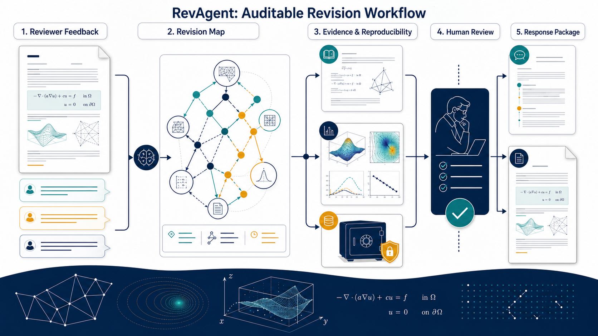

# RevAgent

<p align="center"><strong>Local-first · Auditable · Human-gated</strong></p>

<p align="center"><a href="README.zh-CN.md">简体中文</a> · <a href="#quick-start">Quick start</a> · <a href="docs/advanced-usage.md">Advanced usage</a> · <a href="SECURITY.md">Security</a></p>

RevAgent is a local-first, auditable revision assistant for computational-mathematics manuscripts. It turns editor and reviewer feedback into tracked review items, source locations, revision plans, evidence records, response drafts, and explicit author decisions.

> [!NOTE]
> Designed for revision workflows common in *SISC*, *SINUM*, *Mathematics of Computation*, *IMA Journal of Numerical Analysis*, *Journal of Computational Physics*, and *Numerische Mathematik*. These are representative use cases, not endorsements or submission guarantees.

<p align="center"></p>

<p align="center"><em>Feedback → revision map → evidence → human review → response package</em></p>

## At a glance

| Material | Support |
| --- | --- |
| Manuscript | A complete LaTeX source tree. RevAgent can index labels, theorem-like environments, references, and source locations; candidate edits and compilation checks are LaTeX-only in v0.1. |
| Reviewer comments | **Preferred:** `.tex` or `.md`, parsed directly. `.txt` is also parsed directly. `.docx` and text-based `.pdf` are converted locally to an auditable Markdown copy before parsing. |

All material stays local. A converted comment copy, its source hash, and its conversion record are written under `.revagent/`; the original file is never changed or uploaded.

> [!TIP]
> For the clearest item boundaries and source locations, use TeX or Markdown for reviewer comments.

## Quick start

### 1. Install

Use any local terminal with Python 3.10+, including the terminal provided by Codex, Claude Code, or another coding agent:

```powershell
git clone https://github.com/chenyongssss/revagent.git
cd revagent
python -m venv .venv
& .\.venv\Scripts\Activate.ps1
python -m pip install -e .[dev]
```

On macOS or Linux, activate with `source .venv/bin/activate`.

**Using a coding agent:** open the cloned `revagent` folder in Codex, Claude Code, or another local coding agent, then ask it to run the install commands in that folder. The commands create the environment and install the project locally; RevAgent does not require Codex or any specific agent at runtime.

### 2. Prepare one revision workspace

Work from a copy of the manuscript:

```text
my-paper-review/
  manuscript/
    paper.tex
    sections/
    bibliography.bib
  reviewer_comments.tex   # or .md, .txt, .docx, .pdf
```

Keep the full LaTeX source tree in `manuscript/`, including files referenced by `\input` or `\include`. TeX and Markdown reviewer files are recommended because their item boundaries and line locations are preserved directly.

### 3. Run the first pass

From `my-paper-review/`:

```powershell
revagent init --journal siam --tex-root manuscript --main-tex paper.tex
revagent ingest-comments reviewer_comments.tex
revagent plan
revagent draft
revagent cockpit --lang en
revagent validate
```

- `init` creates `.revagent/` and identifies the manuscript entry point.
- `ingest-comments` imports individual editor/reviewer requests; DOCX and PDF imports also create a local normalized Markdown record.
- `plan` connects requests to LaTeX locations and records revision or evidence obligations without changing the manuscript.
- `draft` prepares reviewable response and candidate-edit artifacts without applying them.
- `cockpit --lang en` creates a local overview; use `--lang zh` for Chinese.
- `validate` checks workspace state, provenance, and traceability. Add `--compile` only for an explicit LaTeX compilation check.

**Result:** inspect the generated local records in `.revagent/`, then use the cockpit or the advanced commands when you are ready to review individual items.

## Safety boundary

> [!IMPORTANT]
> RevAgent never certifies proofs, stability, convergence, experiments, response facts, or a final PDF. Those decisions require author or domain-expert approval. Candidate edits are reviewable first and are never silently applied.

## More

- [Advanced usage](docs/advanced-usage.md): per-item commands, local browser access, community calibration, development, and release verification.
- [Security](SECURITY.md): privacy and execution boundaries.
- [Contributing](CONTRIBUTING.md) and [release notes](RELEASE_NOTES.md): project collaboration and version limitations.
