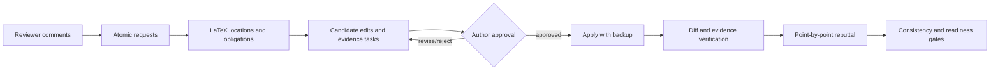

<div align="center">

# RevAgent

### From reviewer comments to verified revisions and a consistent rebuttal

**Local-first · Evidence-traced · Human-gated**

[简体中文](README.zh-CN.md) · [Quick Start](#quick-start) · [Workflow](#the-revision-loop) · [Evaluation](#evaluation) · [Security](SECURITY.md)


</div>

> Give RevAgent a LaTeX manuscript and reviewer comments. It turns every request into a traceable task, proposes guarded edits, checks that response claims match actual manuscript changes, and assembles a rebuttal for author approval.

RevAgent focuses on the revision stage of scientific publishing—not on producing another generic review. It is designed first for computational mathematics and adjacent computational sciences.

## Why RevAgent?

A revision is a consistency problem across four moving parts:

```text
reviewer request  ↔  author decision  ↔  manuscript change  ↔  rebuttal claim
```

RevAgent keeps those links explicit. It helps prevent missed comments, unsupported “we added” statements, edits without evidence, and rebuttal text that no longer matches the final manuscript.

## The revision loop



### What is automated?

| Layer | RevAgent does |
| --- | --- |
| Semantic | Uses an optional LLM to interpret comments, classify requests, locate relevant passages, propose edits, and draft responses. |
| Deterministic | Hashes inputs, tracks source locations, computes diffs, validates schemas, checks coverage and provenance, and blocks unverified claims. |
| Human gate | Requires the author or a domain expert to approve scientific claims, experiments, proofs, final edits, and submission. |

The LLM proposes; the evidence system verifies structure and provenance; the author remains accountable for scientific correctness.

## Quick start

```bash
git clone https://github.com/chenyongssss/revagent.git
cd revagent
python -m venv .venv
python -m pip install -e .
```

Activate with `.venv\Scripts\Activate.ps1` on Windows or `source .venv/bin/activate` on macOS/Linux.

```bash
revagent init --journal siam --tex-root manuscript --main-tex paper.tex
revagent revision-run --comments reviewer_comments.tex
revagent revision-consistency
```

Review and approve candidates, then:

```bash
revagent revision-apply
revagent cockpit --lang en
revagent validate
```

RevAgent never silently applies an unapproved candidate. `ready_for_author_submission` means the local workflow gates passed; it is not a journal decision or scientific certification.

## What you get

```text
.revagent/
├── review_comment_atoms.json   # normalized reviewer requests
├── revision_tasks.json         # actionable revision plan
├── candidate_edits.json        # reviewable edit candidates
├── response_trace.json         # request → edit → evidence → response
├── revision_consistency.json   # cross-artifact consistency checks
├── rebuttal_draft.md           # point-by-point draft
└── revision_readiness.json     # remaining blockers and readiness
```

## Evaluation

| Evidence | Count | Status |
| --- | ---: | --- |
| Private computational-mathematics histories | 3 | Complete version chains; metadata and aggregate hashes only |
| Public eLife histories | 5 | Complete manuscript-version + review/response chains |
| Public F1000 records | 3 | Legacy review-only agent-coded cases |

Across the eight public proxy cases, the current report contains 23 adjudicated findings with 100% evidence-excerpt coverage and 100% provenance completeness. These are agent-coded silver metrics—not human-expert accuracy estimates.

See [the evaluation release](benchmarks/release-v0.1/README.md), [community data governance](docs/community-contributions.md), and [release notes](RELEASE_NOTES.md).

## Journal and domain support

RevAgent includes profiles and reviewer packs for workflows common to SISC, SINUM, *Mathematics of Computation*, IMA Journal of Numerical Analysis, Journal of Computational Physics, and *Numerische Mathematik*. Names indicate workflow targets, not endorsement by any journal.

## Safety boundary

> [!IMPORTANT]
> RevAgent is an alpha author-assistance system. It does not certify proofs, convergence, stability, experiments, novelty, response facts, or a final PDF. It does not autonomously submit manuscripts. Use it in supervised or shadow mode until independent human-expert calibration is complete.

Private manuscript material stays local. `Cases/`, `.revagent/`, caches, credentials, and generated working artifacts are excluded from the release package.

## Documentation

- [User guide](docs/user-guide.md)
- [Advanced usage](docs/advanced-usage.md)
- [Dashboard](docs/dashboard.md)
- [Pre-submission and revision checks](docs/pre-submission-review.md)
- [Community contributions and public records](docs/community-contributions.md)
- [Security policy](SECURITY.md)
- [Contributing](CONTRIBUTING.md)

## License

Code is released under the [MIT License](LICENSE). Public evaluation records retain their source attribution and per-record license metadata.
