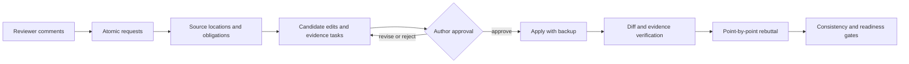

<div align="center">

# RevAgent

### Evidence-grounded manuscript revision, from reviewer comment to rebuttal

**Local-first · Traceable by design · Human-gated**

[简体中文](README.zh-CN.md) · [Quick Start](#quick-start) · [How It Works](#how-it-works) · [Evaluation](#evaluation) · [Documentation](#documentation)


</div>

> Give RevAgent a LaTeX manuscript and reviewer comments. It turns each request into a traceable task, proposes reviewable edits, verifies that rebuttal claims match the manuscript, and keeps the author in control of every consequential decision.

RevAgent is a local-first Python CLI for the revision stage of scientific publishing, with initial support focused on computational mathematics and neighboring computational sciences.

An LLM may interpret comments and draft text, but it is optional. Hashing, source anchoring, diffs, provenance, consistency checks, and approval gates are deterministic and run locally. RevAgent can also be operated through Codex or Claude Code without giving either agent authority to approve scientific claims or apply edits silently.

## ⚡ TL;DR

```text
reviewer request  ↔  author decision  ↔  manuscript change  ↔  rebuttal claim
```

Most revision failures occur when one of these links breaks: a comment is missed, a change is not actually applied, evidence becomes stale, or the rebuttal promises more than the manuscript contains. RevAgent makes the links explicit and blocks the workflow when they cannot be verified.

| What you need | What RevAgent provides |
| --- | --- |
| No missed reviewer requests | Atomic request extraction and coverage tracking |
| Safe manuscript changes | Anchored candidates, previews, explicit approval, and backups |
| Defensible scientific claims | Proof and experiment obligations tied to current evidence |
| A consistent rebuttal | Point-by-point responses linked to actual manuscript diffs |
| A clear handoff | Local dashboards, blockers, provenance, and readiness reports |

## 🔄 How It Works



### Three layers, one responsibility boundary

| Layer | Responsibility |
| --- | --- |
| Optional semantic layer | An LLM interprets comments, locates relevant passages, proposes edits, and drafts responses. |
| Deterministic assurance layer | RevAgent hashes inputs, binds source locations, computes diffs, validates schemas, checks coverage, and rejects stale or unsupported artifacts. |
| Human decision layer | The author or a domain expert approves scientific claims, proofs, experiments, final edits, and submission. |

**The model proposes. RevAgent traces and verifies. The author decides.**

## 🚀 Quick Start

### 1. Install

```bash
git clone https://github.com/chenyongssss/revagent.git
cd revagent
python -m venv .venv
python -m pip install -e .
```

Activate the environment with `.venv\Scripts\Activate.ps1` on Windows or `source .venv/bin/activate` on macOS/Linux.

### 2. Initialize a revision workspace

Prepare a LaTeX source tree such as `manuscript/` and a reviewer-comments file, then run:

```bash
revagent init --journal siam --tex-root manuscript --main-tex paper.tex
revagent revision-run --comments reviewer_comments.tex
revagent revision-consistency
```

### 3. Review, approve, and validate

Inspect the generated candidates and approve only the changes you accept. Then:

```bash
revagent revision-apply
revagent cockpit --lang en
revagent validate
```

RevAgent never silently applies an unapproved candidate. `ready_for_author_submission` means that the local workflow gates passed; it is not a journal decision or a certification of scientific correctness.

## 🤖 Optional Agent Integration

RevAgent works without a coding agent. If you prefer an agent-operated workflow, first preview the generated prompt:

```bash
revagent run --backend codex --goal "continue the revision workflow" --dry-run
revagent run --backend claude --goal "continue the revision workflow" --dry-run
```

Remove `--dry-run` only after reviewing the prompt. These adapters invoke the same RevAgent commands and preserve the same approval and validation gates. Other agents can integrate by reading the generated prompt under `.revagent/prompts/`.

## 📦 What You Get

```text
.revagent/
├── review_comment_atoms.json   # normalized reviewer requests
├── revision_tasks.json         # actionable revision plan
├── candidate_edits.json        # reviewable edit candidates
├── response_trace.json         # request → edit → evidence → response
├── revision_consistency.json   # cross-artifact consistency checks
├── rebuttal_draft.md           # point-by-point response draft
└── revision_readiness.json     # blockers and readiness state
```

The local cockpit turns these artifacts into a compact author-facing view of requests, risks, evidence status, blockers, and pending decisions.

## 📊 Evaluation

| Evidence source | Cases | Current status |
| --- | ---: | --- |
| Private computational-mathematics revision histories | 3 | Complete version chains; only redacted metadata and aggregate hashes are reported |
| Public eLife revision histories | 5 | Complete manuscript-version, review, and author-response chains |
| Public F1000 records | 3 | Legacy review-only, agent-coded cases |

Across the eight public proxy cases, the current release reports 23 adjudicated findings with 100% evidence-excerpt coverage and 100% provenance completeness. These are **agent-coded silver metrics**, not estimates of human-expert accuracy.

See the [evaluation release](benchmarks/release-v0.1/README.md), [community data governance](docs/community-contributions.md), and [release notes](RELEASE_NOTES.md).

## 🎯 Journal and Domain Support

RevAgent ships profiles and reviewer packs for workflows common to SISC, SINUM, *Mathematics of Computation*, IMA Journal of Numerical Analysis, Journal of Computational Physics, and *Numerische Mathematik*. These names describe workflow targets and do not imply endorsement by any journal.

## 🛡️ Safety Boundary

> [!IMPORTANT]
> RevAgent is an alpha author-assistance system. It does not certify proofs, convergence, stability, experiments, novelty, response facts, or a final PDF, and it does not submit manuscripts autonomously. Use it in supervised or shadow mode until independent human-expert calibration is complete.

Private manuscript material stays local. `Cases/`, `.revagent/`, caches, credentials, and generated working artifacts are excluded from the release package.

## 📚 Documentation

- [User guide](docs/user-guide.md)
- [Advanced usage](docs/advanced-usage.md)
- [Local dashboard](docs/dashboard.md)
- [Pre-submission and revision checks](docs/pre-submission-review.md)
- [Community contributions and public records](docs/community-contributions.md)
- [Security policy](SECURITY.md)
- [Contributing](CONTRIBUTING.md)

## 📄 License

RevAgent is released under the [MIT License](LICENSE). Public evaluation records retain their original attribution and per-record license metadata.
