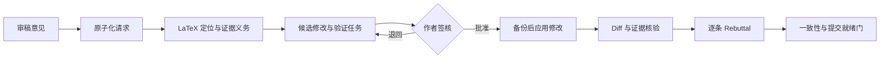

<div align="center">

# RevAgent

### 从审稿意见到已验证修改与一致性 Rebuttal

**本地优先 · 证据可追踪 · 人工签核**

[English](README.md) · [快速开始](#快速开始) · [自动化闭环](#返修自动化闭环) · [真实案例评测](#真实案例评测) · [安全策略](SECURITY.md)


</div>

> 将 LaTeX 稿件和审稿意见交给 RevAgent。它会把每条意见拆成可追踪任务，提出受控修改，核对回复中的陈述是否真的落实到稿件，并生成供作者签核的逐条 rebuttal。

RevAgent 聚焦科研工作者真正耗时的返修阶段，而不是再生成一份泛泛的模拟审稿意见。当前首先面向计算数学及相邻计算科学领域。

## 为什么需要 RevAgent？

返修的核心是保持四类信息一致：

```text
审稿要求  ↔  作者决策  ↔  稿件修改  ↔  rebuttal 陈述
```

RevAgent 显式维护这些关系，减少漏回意见、无证据地声称“已经增加”、修改未写入正文以及回复与最终稿不一致等问题。

## 返修自动化闭环



### 自动化体现在哪里？

| 层级 | 职责 |
| --- | --- |
| LLM 语义层 | 理解审稿意见、拆分请求、判断相关章节、提出修改和起草回复。 |
| 确定性验证层 | 输入哈希、源码定位、版本 diff、schema 校验、覆盖率、来源与证据核对。 |
| 人工签核层 | 作者或领域专家批准科学结论、证明、实验、最终修改和投稿。 |

LLM 负责理解和提出方案；程序负责追踪、验证和阻断；科学正确性仍由作者或专家负责。

## 快速开始

```bash
git clone https://github.com/chenyongssss/revagent.git
cd revagent
python -m venv .venv
python -m pip install -e .
```

准备 `manuscript/` LaTeX 源码树和审稿意见后运行：

```bash
revagent init --journal siam --tex-root manuscript --main-tex paper.tex
revagent revision-run --comments reviewer_comments.tex
revagent revision-consistency
```

审阅并批准候选修改后：

```bash
revagent revision-apply
revagent cockpit --lang zh
revagent validate
```

RevAgent 不会静默应用未经批准的修改。`ready_for_author_submission` 仅表示本地工作流门通过，不代表期刊决定或科学认证。

## 关键产物

```text
.revagent/
├── review_comment_atoms.json   # 原子化审稿请求
├── revision_tasks.json         # 返修任务
├── candidate_edits.json        # 待审阅修改候选
├── response_trace.json         # 意见→修改→证据→回复
├── revision_consistency.json   # 跨工件一致性
├── rebuttal_draft.md           # 逐条回复草稿
└── revision_readiness.json     # 阻断项与就绪状态
```

## 真实案例评测

| 证据类型 | 数量 | 状态 |
| --- | ---: | --- |
| 私有计算数学返修历史 | 3 | 版本链完整；仅公开脱敏元数据与聚合哈希 |
| eLife 公开返修历史 | 5 | 稿件版本、审稿与作者回复链完整 |
| F1000 公开记录 | 3 | 历史 review-only 代理标注案例 |

8 个公开代理案例包含 23 个裁决 finding，证据摘录覆盖率和来源完整性均为 100%。这些属于代理标注的银标准指标，不是真人专家准确率。

参见[公开评测包](benchmarks/release-v0.1/README.md)、[数据治理说明](docs/community-contributions.md)和[发布说明](RELEASE_NOTES.md)。

## 当前边界

> [!IMPORTANT]
> RevAgent 当前是供作者监督使用的 alpha 工具。它不能认证证明、收敛性、稳定性、实验、创新性、回复事实或最终 PDF，也不会自主操作投稿系统。真人专家校准完成前，应在 supervised/shadow 模式使用。

私有论文材料始终保留在本地。`Cases/`、`.revagent/`、缓存、凭据和工作产物不会进入发布包。

## 文档

- [完整使用指南](docs/user-guide.zh-CN.md)
- [高级用法](docs/advanced-usage.md)
- [Dashboard](docs/dashboard.md)
- [预审与返修检查](docs/pre-submission-review.md)
- [社区贡献与公开记录](docs/community-contributions.md)
- [安全策略](SECURITY.md)
- [贡献指南](CONTRIBUTING.md)

## 许可证

代码采用 [MIT License](LICENSE)。公开评测记录保留原始来源、署名和逐条许可信息。
