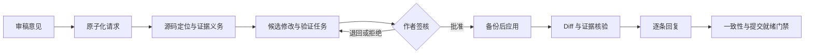

<div align="center">

# RevAgent

### 从审稿意见到逐条回复：让每一次论文返修都有证据可循

**本地优先 · 全程可追踪 · 关键决策由作者签核**

[English](README.md) · [快速开始](#快速开始) · [Codex / Claude Code](#在-codex-或-claude-code-中使用) · [工作原理](#工作原理) · [评测](#评测)


</div>

> 将 LaTeX 稿件和审稿意见交给 RevAgent。它会把每项要求拆成可追踪任务，提出可审阅的修改，核对回复是否与稿件一致，并把所有关键决定留给作者。

RevAgent 是面向科研论文返修阶段的本地优先 Python CLI，目前重点支持计算数学及相邻计算科学领域。

LLM 可以协助理解意见和起草文本，但并非必需。输入哈希、源码锚定、版本差异、证据溯源、一致性检查和审批门禁均由确定性程序在本地完成。你也可以让 Codex 或 Claude Code 操作 RevAgent，但它们无权代替作者批准科学结论或静默应用修改。

## ⚡ 一句话了解 RevAgent

```text
审稿要求  ↔  作者决策  ↔  稿件修改  ↔  回复陈述
```

论文返修最常见的问题，往往来自其中某一环断裂：遗漏意见、修改没有真正写入稿件、证据已经过期，或回复中的承诺超出了正文实际内容。RevAgent 将这些关联显式记录，并在无法验证时阻断流程。

| 返修需求 | RevAgent 提供的能力 |
| --- | --- |
| 不遗漏审稿要求 | 原子化拆分意见并追踪覆盖情况 |
| 安全地修改稿件 | 锚定源码、预览候选、显式审批并保留备份 |
| 支撑科学陈述 | 将证明与实验义务绑定到当前证据 |
| 保持回复一致 | 把逐条回复关联到真实的稿件 diff |
| 清楚掌握进度 | 提供本地看板、阻断项、溯源与就绪报告 |

## 🔄 工作原理



### 三层协作，一条清晰的责任边界

| 层级 | 职责 |
| --- | --- |
| 可选语义层 | LLM 理解审稿意见、定位相关段落、提出修改并起草回复。 |
| 确定性保障层 | RevAgent 计算哈希、绑定源码位置、生成 diff、校验 schema、检查覆盖率，并拒绝过期或缺乏依据的产物。 |
| 人工决策层 | 作者或领域专家批准科学结论、证明、实验、最终修改和投稿。 |

**模型负责提出方案，RevAgent 负责追踪与核验，作者负责最终决定。**

## 🚀 快速开始

### 1. 安装

```bash
git clone https://github.com/chenyongssss/revagent.git
cd revagent
python -m venv .venv
python -m pip install -e .
```

Windows 用户运行 `.venv\Scripts\Activate.ps1` 激活环境；macOS/Linux 用户运行 `source .venv/bin/activate`。

### 2. 初始化返修工作区

准备 `manuscript/` LaTeX 源码树和审稿意见文件，然后运行：

```bash
revagent init --journal siam --tex-root manuscript --main-tex paper.tex
revagent revision-run --comments reviewer_comments.tex
revagent revision-consistency
```

### 3. 审阅、批准并验证

检查生成的修改候选，只批准你认可的内容，然后运行：

```bash
revagent revision-apply
revagent cockpit --lang zh
revagent validate
```

RevAgent 不会静默应用未经批准的修改。`ready_for_author_submission` 仅表示本地工作流门禁已通过，不代表期刊决定，也不构成科学正确性认证。

## 🤖 在 Codex 或 Claude Code 中使用

大多数 RevAgent 用户可以继续留在熟悉的 Codex 或 Claude Code 中工作。Coding agent 负责读取工作区、运行安全命令并起草修改；RevAgent 负责将草稿绑定到 LaTeX 位置、证据、哈希和溯源记录。批准与应用修改始终是明确的作者操作。

### 1. 在 Agent 中打开仓库

在仓库根目录启动 `codex` 或 `claude`，然后粘贴以下提示词：

```text
阅读 .revagent/agent_report.md 和 plan.md，使用安全的 RevAgent 命令继续论文返修流程。分析审稿要求，提出稿件修改候选，并起草逐条回复。绝不批准或应用任何修改。遇到需要作者判断、科学验证或权限确认的步骤时立即停止，并向作者报告下一条需要亲自执行的准确命令。
```

### 2. 让 Agent 分析并起草

Agent 可以执行以下不涉及审批的安全工作流：

```bash
revagent agent-status
revagent review-analysis R001
revagent propose
```

请将 `R001` 替换为需要处理的审稿事项编号。此阶段 agent 可以分析、规划和提出候选，但不得执行 `approve`、`revision-apply`，也不得代替作者作出科学判断。

### 3. 由作者审阅并批准

作者应亲自检查每个候选。批准必须是独立、明确的作者操作：

```bash
revagent inspect C001
revagent approve C001
revagent revision-apply
```

请将 `C001` 替换为已经审阅的候选编号。涉及证明、实验或科学结论的高风险修改，应先完成相应的证据与专家审阅门禁，再予以批准。

### 4. 验证最终返修结果

```bash
revagent revision-consistency
revagent validate
```

责任边界很清楚：**coding agent 负责起草，RevAgent 负责验证并阻断过期修改，作者始终保留科学决策权。**

RevAgent 也可以生成适配特定后端的工作流提示。启动集成前请先预览：

```bash
revagent run --backend codex --goal "continue the revision workflow" --dry-run
revagent run --backend claude --goal "continue the revision workflow" --dry-run
```

审阅生成的提示后再移除 `--dry-run`。两个适配器都会保留相同的审批与验证门禁。

## 📦 关键产物

```text
.revagent/
├── review_comment_atoms.json   # 标准化的审稿请求
├── revision_tasks.json         # 可执行的返修计划
├── candidate_edits.json        # 待审阅的修改候选
├── response_trace.json         # 意见 → 修改 → 证据 → 回复
├── revision_consistency.json   # 跨产物一致性检查
├── rebuttal_draft.md           # 逐条回复草稿
└── revision_readiness.json     # 阻断项与就绪状态
```

本地 cockpit 会将这些产物整理成面向作者的紧凑视图，集中展示审稿要求、风险、证据状态、阻断项和待决策事项。

## 📊 评测

| 证据来源 | 案例数 | 当前状态 |
| --- | ---: | --- |
| 私有计算数学返修历史 | 3 | 版本链完整；仅报告脱敏元数据与聚合哈希 |
| eLife 公开返修历史 | 5 | 稿件版本、审稿意见与作者回复链完整 |
| F1000 公开记录 | 3 | 早期仅审稿、由 agent 标注的案例 |

在 8 个公开代理案例中，当前发布包含 23 个经过裁决的 finding，证据摘录覆盖率与来源完整性均为 100%。这些是 **agent 标注的银标准指标**，并非真人专家准确率。

详见[公开评测包](benchmarks/release-v0.1/README.md)、[社区数据治理说明](docs/community-contributions.md)和[发布说明](RELEASE_NOTES.md)。

## 🎯 期刊与领域支持

RevAgent 提供适用于 SISC、SINUM、*Mathematics of Computation*、IMA Journal of Numerical Analysis、Journal of Computational Physics 和 *Numerische Mathematik* 常见工作流的配置与 reviewer packs。上述名称仅表示工作流目标，不代表任何期刊的认可或背书。

## 🛡️ 安全边界

> [!IMPORTANT]
> RevAgent 当前是供作者监督使用的 alpha 工具。它不能认证证明、收敛性、稳定性、实验、创新性、回复事实或最终 PDF，也不会自主操作投稿系统。在完成独立真人专家校准前，请以 supervised 或 shadow 模式使用。

私有论文材料始终保留在本地。`Cases/`、`.revagent/`、缓存、凭据和生成的工作产物不会进入发布包。

## 📚 文档

- [完整使用指南](docs/user-guide.zh-CN.md)
- [高级用法](docs/advanced-usage.md)
- [本地看板](docs/dashboard.md)
- [预审与返修检查](docs/pre-submission-review.md)
- [社区贡献与公开记录](docs/community-contributions.md)
- [安全策略](SECURITY.md)
- [贡献指南](CONTRIBUTING.md)

## 📄 许可证

RevAgent 采用 [MIT License](LICENSE)。公开评测记录保留原始来源、署名和逐条许可信息。
